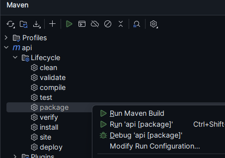
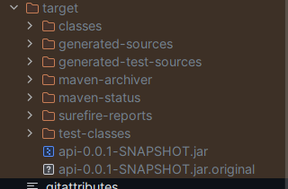

# DEPLOY DO PROJETO

1. Build do projeto via Maven:


2. Após isso, temos um arquivo .jar do java que contém o nosso projeto empacotado. Esse projeto fica em uma pasta criada pelo Maven chamada "target":


3. Como executar a aplicação via terminal, com o comando java -jar, passando as variáveis de ambiente como parâmetro:
    ```bash
    java -Dspring.profiles.active=prod -DDB_HOST=url_do_projeto -DDB_USER=seu_username -DDB_PASSWORD=sua_senha -jar target/api-0.0.1-SNAPSHOT.jar
    ```